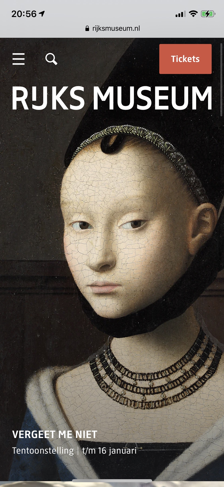
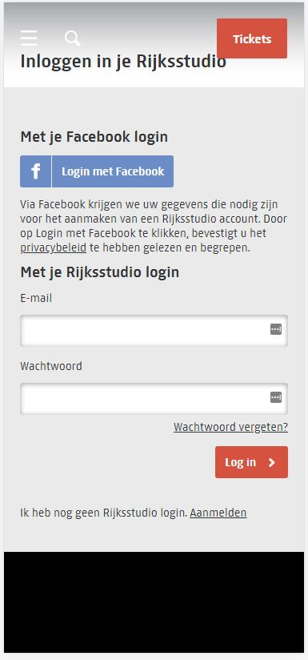
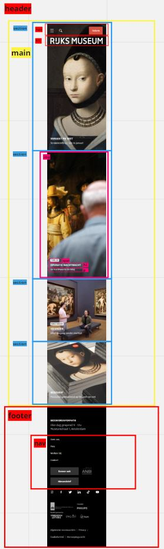
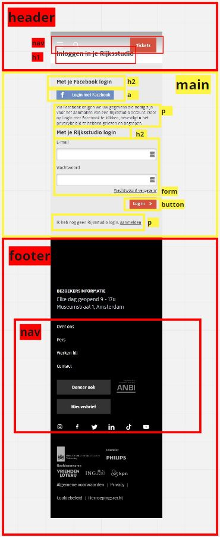
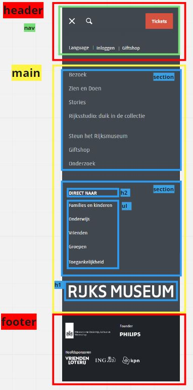
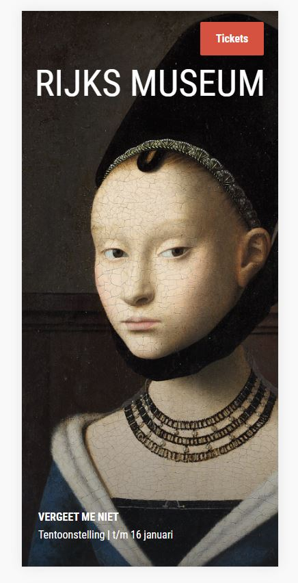
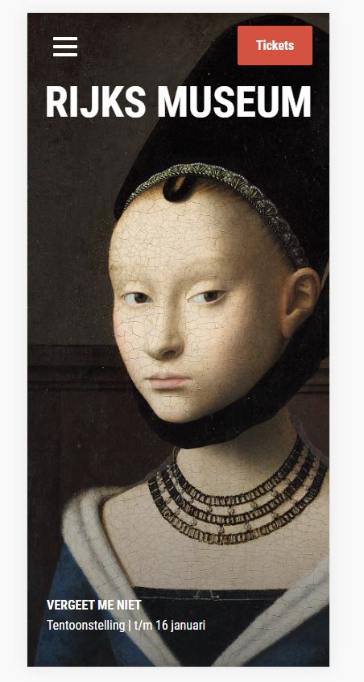
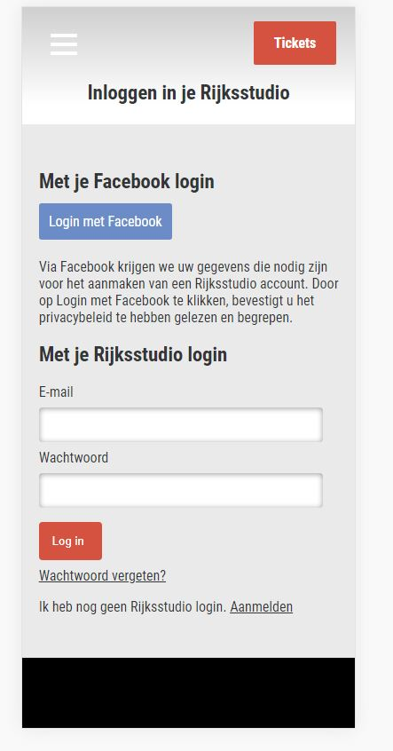

## Jij

uitwerken voor kick-off werkgroep

### Auteur:
Hamza Malik

#### Je startniveau:
Blauw (Ik denk dat ik het ga mixen met rood als het te makkelijk is)

#### Je focus:
extra aandacht voor de surface laag
 

## Je website

uitwerken voor kick-off werkgroep

### Je opdracht:
rijksmuseum.nl

#### Screenshot(s) van de eerste pagina (small screen): 
homepage

#### Screenshot(s) van de tweede pagina (small screen):
inlogscherm

 

## Breakdownschets (week 1)

uitwerken na afloop 2e werkgroep

### breakdown homepage: 

### breakdown inlogscherm: 

### breakdown menu: 

## Voortgang 1 (week 2)

uitwerken voor 1e voortgang

### Stand van zaken

Het ging goed, het opstarten was een beetje moeizaam, maar uiteindelijk heb ik de eerste section weten te maken alleen is hij nog niet responsive.

### Agenda voor meeting
samen met je groepje opstellen

| hamza          | milou      
| ---            | ---               
| h1 responsive  | opmaak website         
| hamburgermenu  | iphone formaat     
| ...            | ...               

### Verslag van meeting
hier na afloop snel de uitkomsten van de meeting vastleggen

linkjes gekregen hoe ik nu verder moet gaan, over de hamburgermenu en daar advies over gekregen.

## Voortgang 2 (week 3)

uitwerken voor 2e voortgang

### Stand van zaken
ik heb al meerdere sections uitgewerkt, dat gaat makkelijk nu ik de eerste al heb gehad. echter lukt de h1 responsive krijgen niet zo goed
en weet ik niet wat ik met de shadow overlay moet doen.

### Agenda voor meeting
samen met je groepje opstellen

| hamza          | student 2          | student 3    | student 4        |
| ---            | ---                | ---          | ---              |
| shadow overlay | en dit             | en ik dit    | en dan ik dat    |
| h1 lukt niet   | dit als er tijd is | nog een punt | dit wil ik zeker |
| ...            | ...                | ...          | ...              |

### Verslag van meeting
hier na afloop snel de uitkomsten van de meeting vastleggen

ik moet kijken naar mulitple backgrounds css, en om h1 responsive te krijgen moet ik gebruik maken van VW

## Toegankelijkheidstest (week 4)

uitwerken na test in 8e voortgang

### Bevindingen
Lijst met je bevindingen die in de test naar voren kwamen:

#### Screenreader
De screenreader leest alles op wat opgelezen moet worden, echter is de tekst best wel onduidelijk en omschrijft het niet zoveel.

Hier een omschrijving van hoe het opgelost kan worden (met indien nodig een afbeelding)
Het kan opgelost worden door betere titels te gebruiken en niet een woord die opzichzelf niks zegt.

#### Tab
Met de tabknop kan je langs alle linkjes en buttons, alleen de menuknop kan niet geactiveerd worden verder alles.

Dit kan je oplossen doormiddel van een button te maken van de menuknop.

#### Wazige bril

hier zie je dat je door de bril alsnog alles best goed kan lezen, behalve de kleine kopjes 

oplossing: grote kopjes.

## Voortgang 3 (week 4)

uitwerken voor 3e voortgang

### Stand van zaken
ik heb heel de eerste pagina uitgewerkt, alleen de footer moet nog een paar aanpassingen krijgen.

### Agenda voor meeting
samen met je groepje opstellen

| hamza                |       student 2          | student 3    | student 4        |
| ---                  | ---                | ---          | ---              |
| geen vragen,         | en dit             | en ik dit    | en dan ik dat    |
| ik moet hard door werken | dit als er tijd is | nog een punt | dit wil ik zeker |
| ...                     | ...                | ...          | ...              |

### Verslag van meeting
hier na afloop snel de uitkomsten van de meeting vastleggen

ik ben goed opweg, maar ik moet hard door werken om alles af te krijgen.

## Eindgesprek (week 5)

uitwerken voor eindgesprek

### Stand van zaken
het ging best goed over het algemeen, bepaalde dingen waren lastiger zoals javascript met het menu. bepaalde dingen goed uitlijnen.

### Screenshot(s)

## Bronnenlijst

continu bijhouden terwijl je werkt

Nb. Wees specifiek ('css-tricks' als bron is bijv. niet specifiek genoeg).

1. https://stackoverflow.com/questions/8739665/is-background-colornone-valid-css
2. https://stackoverflow.com/questions/28411499/disable-scrolling-on-body
3. https://cssgradient-io.translate.goog/?_x_tr_sl=en&_x_tr_tl=nl&_x_tr_hl=nl&_x_tr_pto=sc
4. https://www.w3schools.com/css/css_form.asp
5. https://stackoverflow.com/questions/2922909/should-i-use-border-none-or-border-0

